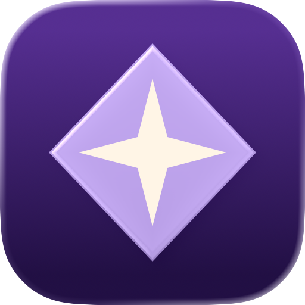
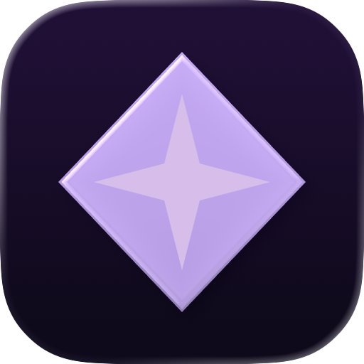
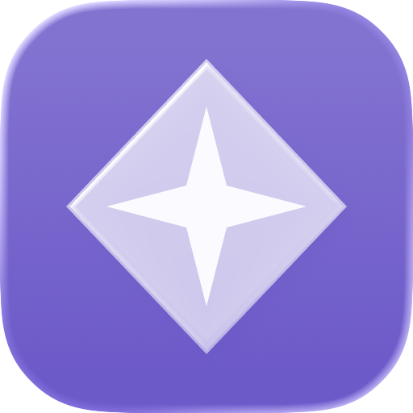
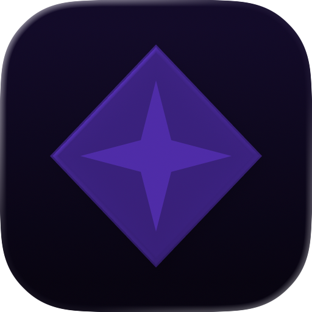

# Icon Composer MCP

Icon Composer MCP (`icon-composer-kit`) is a local MCP server for creating, inspecting, revising, and rendering editable Apple Icon Composer `.icon` documents. It keeps the workspace explicit and local, validates artwork before it is written, and delegates previews to Apple’s signed Icon Composer renderer when it is available.

It is intentionally an icon composer. It accepts static SVG or PNG artwork and arranges that artwork into editable groups, layers, materials, fills, positions, and appearance specializations. It does not generate artwork, vectorize raster images, download assets, or call a network service.

## Preview gallery

These previews were produced from the checked-in recipes with Apple Icon Composer’s native renderer. Each example has a corresponding editable bundle under [`examples/`](examples/).

| Orbit                                   | Bloom                                   | Prism                                   |
| --------------------------------------- | --------------------------------------- | --------------------------------------- |
|  |  |  |

Each recipe can be rendered in all six supported appearances:

| Example | Default                              | Dark                              | Tinted Light                             | Tinted Dark                             | Clear Light                             | Clear Dark                             |
| ------- | ------------------------------------ | --------------------------------- | ---------------------------------------- | --------------------------------------- | --------------------------------------- | -------------------------------------- |
| Orbit   | [512](docs/images/orbit-Default.png) | [512](docs/images/orbit-Dark.png) | [512](docs/images/orbit-TintedLight.png) | [512](docs/images/orbit-TintedDark.png) | [512](docs/images/orbit-ClearLight.png) | [512](docs/images/orbit-ClearDark.png) |
| Bloom   | [512](docs/images/bloom-Default.png) | [512](docs/images/bloom-Dark.png) | [512](docs/images/bloom-TintedLight.png) | [512](docs/images/bloom-TintedDark.png) | [512](docs/images/bloom-ClearLight.png) | [512](docs/images/bloom-ClearDark.png) |
| Prism   | [512](docs/images/prism-Default.png) | [512](docs/images/prism-Dark.png) | [512](docs/images/prism-TintedLight.png) | [512](docs/images/prism-TintedDark.png) | [512](docs/images/prism-ClearLight.png) | [512](docs/images/prism-ClearDark.png) |

| Default                                   | Dark                                | Tinted Light                                       | Tinted Dark                                      | Clear Light                                      | Clear Dark                                     |
| ----------------------------------------- | ----------------------------------- | -------------------------------------------------- | ------------------------------------------------ | ------------------------------------------------ | ---------------------------------------------- |
|  |  |  |  |  |  |

The small previews show the 32 px check used by the examples workflow: [Orbit](docs/images/orbit-32.png), [Bloom](docs/images/bloom-32.png), and [Prism](docs/images/prism-32.png).

## Requirements

- Node.js 24 or newer.
- npm and the checked-in `package-lock.json`.
- A dedicated, writable absolute directory for `ICON_WORKSPACE`.
- macOS with Apple Icon Composer for `composer_status` to report available and for `render_icon` to produce native previews. Document operations support local macOS and Linux filesystems. Windows is not supported by the ownership checks. The verified native tool currently reports version 1.6 in the development environment; availability is checked at runtime.

The server verifies the Apple signing requirement and the expected `com.apple.IconComposerTool` identifier before invoking `ictool`. `ICON_COMPOSER_APP` may point to an absolute `.app` bundle when the renderer is installed outside its default location; malformed values disable native rendering.

## Install and run locally

Clone the repository, then build the local package:

```sh
git clone https://github.com/TheNaubit/icon-composer-mcp.git icon-composer-kit
cd icon-composer-kit
npm ci
npm run build
mkdir -p /absolute/path/icon-workspace
ICON_WORKSPACE=/absolute/path/icon-workspace node "$PWD/dist/server.js"
```

The server speaks MCP over stdio. Keep `ICON_WORKSPACE` dedicated to icons created by this server. The workspace root is an operator setting, not a tool argument, and must be an absolute real directory below the filesystem root.

## Install in your MCP host

Build once with `npm ci` and `npm run build`, then choose your host below. These are local installations: run the host on the Mac that has Icon Composer to render previews. Linux supports document operations only. Browser-only and remote coding sessions cannot launch the renderer on your Mac through this stdio configuration.

Replace `/absolute/path/icon-composer-kit` with your checkout and `/absolute/path/icon-workspace` with a dedicated output directory. For desktop apps, replace `/absolute/path/node` with the result of `command -v node` (Node 24+). JSON and TOML paths are literal: do not put `~` or `$PWD` in them. Merge entries into existing configuration rather than replacing other servers.

| Host                                           | Setup                       | Verify                              |
| ---------------------------------------------- | --------------------------- | ----------------------------------- |
| [Codex CLI](#codex-cli)                        | `codex mcp add` or TOML     | `codex mcp get` and `/mcp`          |
| [Codex app](#codex-app)                        | Shared local Codex TOML     | Restart app, start a new local task |
| [Claude Code](#claude-code)                    | `claude mcp add`            | `claude mcp get` and `/mcp`         |
| [Claude Desktop — Chat](#claude-desktop--chat) | Desktop JSON configuration  | Restart app, start a new Chat       |
| [Claude Cowork](#claude-cowork)                | Manual local plugin wrapper | Enable plugin and check its tools   |
| [Cursor](#cursor)                              | User or project `mcp.json`  | Enable server in MCP settings       |
| [VS Code](#vs-code)                            | `.vscode/mcp.json`          | Start server, select chat tools     |

No published npm package or one-click extension is assumed by these instructions. Keep machine-specific configuration and any plugin ZIP you customize outside this public repository.

### Codex CLI

Register for your user:

```sh
codex mcp add icon-composer-kit \
  --env ICON_WORKSPACE=/absolute/path/icon-workspace \
  -- /absolute/path/node /absolute/path/icon-composer-kit/dist/server.js
codex mcp get icon-composer-kit
```

Start a new `codex` session and use `/mcp` to check the connection. To remove the registration, run `codex mcp remove icon-composer-kit`; icon files remain on disk.

Alternatively, merge this into `~/.codex/config.toml`. For a trusted project only, use that project's `.codex/config.toml` instead:

```toml
[mcp_servers.icon-composer-kit]
command = "/absolute/path/node"
args = ["/absolute/path/icon-composer-kit/dist/server.js"]

[mcp_servers.icon-composer-kit.env]
ICON_WORKSPACE = "/absolute/path/icon-workspace"
```

[Official Codex MCP documentation](https://developers.openai.com/codex/mcp/).

### Codex app

The app and CLI share MCP configuration on the same local Codex host. Use the CLI registration above, or add the same TOML block to `~/.codex/config.toml` if you do not use the CLI. Restart the app and open a new local task. Ask it to call `composer_status`, then `list_icons`.

Use the configuration on the Mac running the task, not a separate remote host. To uninstall, remove the TOML server block and its environment subtable, then restart the app. [Official shared-configuration guidance](https://developers.openai.com/codex/mcp/).

### Claude Code

Use user scope for access across your projects:

```sh
claude mcp add --transport stdio --scope user \
  --env ICON_WORKSPACE=/absolute/path/icon-workspace \
  icon-composer-kit -- /absolute/path/node /absolute/path/icon-composer-kit/dist/server.js
claude mcp get icon-composer-kit
```

Start a new Claude Code session and run `/mcp`. All six tools should be available. To restrict installation to your current project without sharing its paths, replace `--scope user` with `--scope local`. `--scope project` writes shared `.mcp.json` configuration; avoid committing personal absolute paths there.

Remove it with `claude mcp remove --scope user icon-composer-kit`, using the same scope you installed. [Official Claude Code MCP guide](https://code.claude.com/docs/en/mcp).

### Claude Desktop — Chat

On macOS, open Claude Desktop's **Settings → Developer → Edit Config**, or edit `~/Library/Application Support/Claude/claude_desktop_config.json`. Merge this entry:

```json
{
  "mcpServers": {
    "icon-composer-kit": {
      "command": "/absolute/path/node",
      "args": ["/absolute/path/icon-composer-kit/dist/server.js"],
      "env": { "ICON_WORKSPACE": "/absolute/path/icon-workspace" }
    }
  }
}
```

Fully quit and reopen Claude Desktop. In a new **Chat**, check the available tools and request `composer_status`. Remove the entry and restart to uninstall. This is manual stdio configuration, not an `.mcpb` desktop-extension installation. [Official local-server setup](https://modelcontextprotocol.io/docs/2026-07-28/develop/connect-local-servers).

### Claude Cowork

**Manual local plugin installation.** Claude documents local MCP servers in desktop plugins, but explicitly says legacy `claude_desktop_config.json` servers are not available in Cowork. Use the plugin mechanism rather than assuming the Chat setup transfers. Local plugin execution requires the desktop app and can be disabled by organization policy. See [Cowork architecture](https://support.claude.com/en/articles/14479288-claude-cowork-architecture-overview) and [the legacy-configuration limitation](https://support.claude.com/en/articles/11175166-get-started-with-custom-connectors-using-remote-mcp).

To prepare a machine-local wrapper, create this folder **outside the checkout**:

```text
icon-composer-local/
├── .claude-plugin/
│   └── plugin.json
└── .mcp.json
```

Put this in `.claude-plugin/plugin.json`:

```json
{
  "name": "icon-composer-local",
  "version": "1.0.0",
  "description": "Local Apple Icon Composer tools"
}
```

Put the JSON from the **Claude Desktop — Chat** section in `.mcp.json`, with your actual absolute paths. The wrapper references your existing built checkout and dependencies; it does not bundle or download them. This layout follows the [official plugin MCP reference](https://code.claude.com/docs/en/plugins-reference#mcp-servers).

From the wrapper directory, include both hidden entries in the archive:

```sh
zip -r ../icon-composer-local.zip .claude-plugin .mcp.json
```

In Claude Desktop, open **Cowork → Customize → Plugins** and use the custom-plugin upload option to install the ZIP. Enable it and start a new task. Ask for `composer_status` and `list_icons`; plugin tool names may have a namespace prefix. [Official plugin installation guide](https://support.claude.com/en/articles/13837440-use-plugins-in-claude).

If custom uploads/local MCP execution are unavailable, use Claude Code or Claude Desktop Chat instead. Do not enter a filesystem path in the remote-connector URL field. To uninstall, remove the wrapper from Plugins; retain or archive the separate icon workspace as desired. The customized ZIP contains local paths, so keep it private.

### Cursor

For your user, merge the following into `~/.cursor/mcp.json`. For one project, use `.cursor/mcp.json` in that project instead:

```json
{
  "mcpServers": {
    "icon-composer-kit": {
      "type": "stdio",
      "command": "/absolute/path/node",
      "args": ["/absolute/path/icon-composer-kit/dist/server.js"],
      "env": { "ICON_WORKSPACE": "/absolute/path/icon-workspace" }
    }
  }
}
```

Open Cursor's MCP controls in **Settings / Customize**, enable the server, and reload the window if it has not connected. In Agent chat, ask it to call `composer_status`. Remove the JSON entry to uninstall. [Official Cursor configuration guide](https://prod.cursor.com/docs/mcp).

### VS Code

VS Code uses a `servers` object rather than `mcpServers`. Merge this into `.vscode/mcp.json`, or run **MCP: Open User Configuration** for a user-wide installation:

```json
{
  "servers": {
    "icon-composer-kit": {
      "type": "stdio",
      "command": "/absolute/path/node",
      "args": ["/absolute/path/icon-composer-kit/dist/server.js"],
      "env": { "ICON_WORKSPACE": "/absolute/path/icon-workspace" }
    }
  }
}
```

Use the editor's **Start** action for the server and accept its trust prompt. Select its tools in agent chat and request `composer_status`. To uninstall, stop the server and remove its entry. In a remote VS Code window, ensure the server is configured to run on your local Mac if you need native rendering. [Official VS Code MCP guide](https://code.visualstudio.com/docs/agent-customization/mcp-servers).

### Verify any installation

Ask the host: “Use Icon Composer Kit to call `composer_status` and `list_icons`.” A successful tool response confirms the connection. `composer_status` returning `available: false` means MCP is connected but Apple's renderer could not be verified; document creation can still work.

If no tools appear, run the included client independently:

```sh
ICON_WORKSPACE=/absolute/path/icon-workspace \
  /absolute/path/node /absolute/path/icon-composer-kit/dist/client.js tools
```

This should list six tools. Then check your host's logs, literal absolute paths, Node version and workspace ownership. If Icon Composer is installed separately from Xcode, add `ICON_COMPOSER_APP` to the same server environment configuration with the absolute `.app` path.

These recipes were checked against official documentation on September 5, 2026, and the installed CLI help. Use the linked host documentation if menu labels change.

## Command-line MCP client

The built client is a small diagnostic caller. It starts a child server with the current `ICON_WORKSPACE`, lists the registered tools, or calls one tool using a JSON file.

```sh
export ICON_WORKSPACE=/absolute/path/icon-workspace
node dist/client.js tools
node dist/client.js call list_icons
```

Calls without arguments can omit the JSON file:

```sh
node dist/client.js call composer_status
```

The client accepts JSON input up to 2 MiB and prints the MCP result as JSON. Tool failures return a non-zero exit status. `ICON_WORKSPACE` is required even for `tools` because the client always starts the local server.

## A first icon

The checked-in [`examples/orbit.json`](examples/orbit.json) is a complete `create_icon` request. It uses a two-stop background, two groups, static SVG layers, glass material, and a dark background specialization.

```sh
export ICON_WORKSPACE=/absolute/path/icon-workspace
node dist/client.js call create_icon examples/orbit.json
```

For a dark preview, save this as `render.json` in the checkout (or any local file explicitly passed to the client):

```json
{ "name": "orbit", "rendition": "Dark", "size": 512, "inline": false }
```

```sh
node dist/client.js call render_icon render.json
```

The PNG path in the result is relative to `ICON_WORKSPACE`. Open `orbit.icon` in Apple's Icon Composer to inspect its layers interactively. Save manual editor experiments as a separate copy; they are not imported into the managed specification.

The response contains the logical bundle path (`orbit.icon`) and a SHA-256 revision. Creation never overwrites an existing icon name. To revise an icon, call `read_icon`, copy its complete `spec` and `revision`, then call `update_icon` with a new `outputName`. The original bundle remains unchanged.

## MCP surface

The server registers six tools and one prompt. Tool responses are JSON text, except `render_icon`, which may also include a PNG image when `inline` is true.

| Tool              | Purpose                                                                                            | Writes workspace? |
| ----------------- | -------------------------------------------------------------------------------------------------- | ----------------- |
| `composer_status` | Check whether the verified Apple renderer is available; may return its numeric short version.      | No                |
| `list_icons`      | List valid icon bundle names in the configured workspace.                                          | No                |
| `create_icon`     | Validate a complete specification and create a new editable `.icon` bundle.                        | Yes               |
| `read_icon`       | Read the managed specification and its revision.                                                   | No                |
| `update_icon`     | Verify an expected revision and create a revised specification under a new name.                   | Yes               |
| `render_icon`     | Render one native PNG appearance, save it with a unique filename, and optionally return it inline. | Yes               |

The `compose-icon` prompt provides a composition checklist: a 1024 by 1024 canvas, front-to-back groups and layers, separate glass shapes, dark artwork where useful, six appearance renders, and 32 px/1024 px inspection. Prompt text is guidance; the tool schemas remain authoritative.

## Specification reference

`create_icon` accepts `{name, spec}`. `update_icon` requires `{name, outputName, expectedRevision, spec}`. `expectedRevision` is the 64-character hexadecimal revision returned by `read_icon`. Both accept strict JSON objects. Unknown fields are rejected. The current managed specification is stored as `source.json` inside each bundle and is the authority used by `read_icon` and later updates.

### Icon fields

| Field            | Type                       | Constraints and default                                                     |
| ---------------- | -------------------------- | --------------------------------------------------------------------------- |
| `background`     | `string` or `{top,bottom}` | Required. Colors are six-digit `#RRGGBB`; an object is a vertical gradient. |
| `darkBackground` | Same as `background`       | Optional dark appearance fill.                                              |
| `platform`       | `"iOS" \| "macOS"`         | Defaults to `"iOS"`.                                                        |
| `groups`         | Array                      | Required; 1–4 groups.                                                       |

### Group fields

| Field           | Type                                 | Constraints and default                                     |
| --------------- | ------------------------------------ | ----------------------------------------------------------- |
| `name`          | string                               | Required, 1–80 characters; no control characters.           |
| `layers`        | Array                                | Required; 1–32 layers. Groups and layers are front-to-back. |
| `specular`      | boolean                              | Defaults to `false`.                                        |
| `blur`          | number                               | 0–1, defaults to `0`.                                       |
| `translucency`  | number                               | 0–1, defaults to `0`.                                       |
| `shadow`        | `"none" \| "neutral" \| "chromatic"` | Defaults to `"none"`.                                       |
| `shadowOpacity` | number                               | 0–1, defaults to `0`.                                       |
| `lighting`      | `"combined" \| "individual"`         | Defaults to `"combined"`.                                   |

### Layer fields

| Field           | Type    | Constraints and default                                                                                                            |
| --------------- | ------- | ---------------------------------------------------------------------------------------------------------------------------------- |
| `name`          | string  | Required, 1–80 characters; no control characters.                                                                                  |
| `svg`           | string  | Exactly one primary source is required: static SVG up to 256 KiB.                                                                  |
| `pngBase64`     | string  | Alternative primary source: base64 non-interlaced PNG, at most 1 MiB and 1024 px per side. Pixels are re-encoded without metadata. |
| `darkSvg`       | string  | Optional dark artwork specialization, with the same SVG rules.                                                                     |
| `darkPngBase64` | string  | Optional dark PNG specialization, with the same PNG rules.                                                                         |
| `glass`         | boolean | Defaults to `false`.                                                                                                               |
| `opacity`       | number  | 0–1, defaults to `1`.                                                                                                              |
| `scale`         | number  | 0.01–4, defaults to `1`.                                                                                                           |
| `x`, `y`        | number  | −1024–1024 points, each defaults to `0`.                                                                                           |

The complete icon JSON must be at most 2 MiB and contain at most 64 artwork assets, including dark specializations. SVG accepts a deliberately small static language of geometry, local gradients, masks, and clip paths, with raw input capped at 256 KiB, 4096 elements, and depth 32. External URLs, data URLs, scripts, event attributes, styles, declarations, and unsupported elements are rejected. PNG input must be a valid non-animated, non-interlaced PNG with intact CRCs; ancillary metadata is removed. The MCP transport reserves up to 3 MiB per frame.

Background and untagged SVG colors are emitted as Display P3 values in the native document. PNG pixels are not color-converted and embedded profiles are removed; export PNG artwork as sRGB before importing it.

## Rendering

`render_icon` takes `name`, `rendition`, `size`, `inline`, optional `tintColor`, optional `tintStrength`, and optional `opaqueBackground`.

| Field              | Type                                                                      | Constraints and default                                                                                                    |
| ------------------ | ------------------------------------------------------------------------- | -------------------------------------------------------------------------------------------------------------------------- |
| `rendition`        | `Default`, `Dark`, `TintedLight`, `TintedDark`, `ClearLight`, `ClearDark` | Defaults to `Default`.                                                                                                     |
| `size`             | integer                                                                   | 16–1024 px, defaults to 512.                                                                                               |
| `inline`           | boolean                                                                   | Defaults to `true`; include the PNG as an MCP image when true.                                                             |
| `tintColor`        | number                                                                    | Optional, 0–1. Passed to Apple’s renderer.                                                                                 |
| `tintStrength`     | number                                                                    | Optional, 0–1. Passed to Apple’s renderer.                                                                                 |
| `opaqueBackground` | `#RRGGBB`                                                                 | Optional. Composites the rendered alpha onto an opaque RGB PNG. This is a flattened preview, not an App Store source icon. |

After checking that the native files still match the managed specification, the renderer creates a temporary bundle from `source.json`, then invokes Apple `ictool` with the icon’s configured platform. The output is checked for PNG signature and requested dimensions before it is saved under a generated filename in the workspace. Native rendering has no approximation or network fallback.

## Data, revisions, and safety boundaries

- Names are lowercase identifiers: a letter followed by up to 63 lowercase letters, digits, or hyphens.
- Creation and rendering write with restrictive file modes and never overwrite an existing icon or preview filename.
- `update_icon` is copy-on-write: it requires the current SHA-256 revision and a new output name. A mismatch stops the update.
- Workspace paths are controlled by the process environment. Tool calls cannot select arbitrary filesystem paths.
- The server serializes operations, excludes concurrent workspace writers, limits new writes to a workspace with fewer than 100 top-level entries, and limits valid tool operations to 120 per minute per process. Errors returned through MCP are deliberately generic and do not disclose local paths or native process details.
- The server does not import edits made in the native Icon Composer GUI. If `icon.json` or an expected asset is edited outside this tool, the next read/update rejects the bundle rather than silently reverting it. There is no arbitrary existing `.icon` import.

See [`SECURITY.md`](SECURITY.md) for the project’s reporting policy.

## Examples and verification

The gallery generator reads the three JSON recipes, creates editable documents through MCP, renders all six appearances plus a 32 px preview, and refreshes the checked-in assets. It requires macOS and a verified Apple Icon Composer installation:

```sh
npm run examples
```

The regular checks do not require native rendering:

```sh
npm run format:check
npm run typecheck
npm run coverage
npm run build
```

Continuous integration runs those host-independent checks on Ubuntu. The native gallery is a manual macOS verification because Apple Icon Composer is not available in that CI environment. Run `npm run test:native` on macOS for a separate real MCP verification of PNG layers, solid fills, chromatic shadows, both platforms, all appearances, and opaque exports.

## Design tips

- Start with a simple silhouette that remains legible at 32 px.
- Keep disconnected glass shapes in separate layers so material effects can be controlled independently.
- Use at most four groups and keep layer order explicit.
- Give dark mode its own background and artwork when a light mark loses contrast.
- Use flat groups with `specular: false`, `blur: 0`, `translucency: 0`, `shadow: "none"`, and `glass: false` when the artwork should stay visually stable.
- Inspect both the smallest preview and a large native render before distributing an icon.

## Troubleshooting

| Symptom                                         | Resolution                                                                                                                                                                                                                                                                                                                                                  |
| ----------------------------------------------- | ----------------------------------------------------------------------------------------------------------------------------------------------------------------------------------------------------------------------------------------------------------------------------------------------------------------------------------------------------------- |
| Server exits before tools appear                | Set an absolute `ICON_WORKSPACE`; use Node 24+ and run `npm ci` then `npm run build`. The directory and managed files must be owned by your account and not group/world writable.                                                                                                                                                                           |
| `composer_status` reports unavailable           | Install [Apple Icon Composer](https://developer.apple.com/icon-composer/). The default is the copy inside `/Applications/Xcode.app`. For a standalone copy set `ICON_COMPOSER_APP=/Applications/Icon\ Composer.app` in your shell, or the equivalent literal value in the host's `env` object. OS sandbox/trust restrictions can also prevent verification. |
| Icon name already exists                        | Choose a new name; use `read_icon` and `update_icon` to preserve revision history.                                                                                                                                                                                                                                                                          |
| Native document was modified / unexpected files | Preserve the manual copy. Create a new managed icon using your desired specification. Do not remove `source.json` or store unrelated files inside a managed bundle.                                                                                                                                                                                         |
| Workspace busy after a crash                    | Stop every process using that workspace. Inspect and remove only its stale `.operation-lock` directory; archive leftover `.render-*` temporary directories before restarting. Do not remove an active writer's lock.                                                                                                                                        |
| Workspace limit reached                         | Archive older icons/previews outside the active workspace, or configure a new dedicated workspace. There is no deletion tool.                                                                                                                                                                                                                               |
| SVG rejected                                    | Export plain paths/shapes with inline presentation attributes. Convert text to paths in your artwork editor; remove CSS, embedded images, external references and filters.                                                                                                                                                                                  |
| PNG rejected                                    | Export a static, non-interlaced sRGB PNG at up to 1024 px per side and 1 MiB.                                                                                                                                                                                                                                                                               |
| Opaque export fails on a detailed render        | Flattening currently accepts native PNGs up to 1 MiB; the ordinary preview path allows 6 MiB. Try a smaller preview.                                                                                                                                                                                                                                        |
| Glass looks joined or unexpected                | Put disconnected shapes in separate layers and compare all six native renditions.                                                                                                                                                                                                                                                                           |

The native document format is not a versioned public Apple API. Compatibility is checked against the installed renderer; a future Apple update may require a mapping change. The package does not automate Xcode project integration, compile asset catalogs, or export an unmasked App Store source icon. `opaqueBackground` flattens the rendered preview, including its rounded silhouette.

## Architecture

```text
MCP host or included CLI client
  → stdio transport and strict schemas
  → workspace ownership, revision and file checks
  → validated SVG/PNG assets + editable native .icon
  → verified Apple ictool → bounded PNG response
```

The runtime uses the official MCP server/client packages, Zod, Saxes, and PNGJS. There is no shell command builder, HTTP server, database, background service, or bundled Apple binary. Source modules, tests and reproducible examples are included in this repository; [`AGENTS.md`](AGENTS.md) maps their responsibilities.

## Contributing

Read [`CONTRIBUTING.md`](CONTRIBUTING.md) before opening a change. The repository is licensed under the MIT License.
